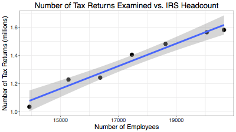
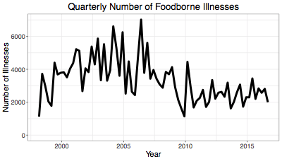

# Employment and Performance in U.S. Federal Agencies (Stanford MS&E 231 Project)

The goal of this project is to evaluate the performance of several U.S. federal agencies or categories of employees, with respect to well-defined metrics. We focus on tax auditors within the Internal Revenue Service (IRS), as well as food inspectors in the Food Safety and Inspection Service.

__Here is a [paper summarizing our methods and findings](https://goo.gl/T79Gfv)__.

 
 